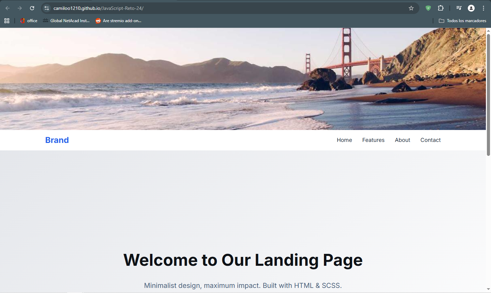
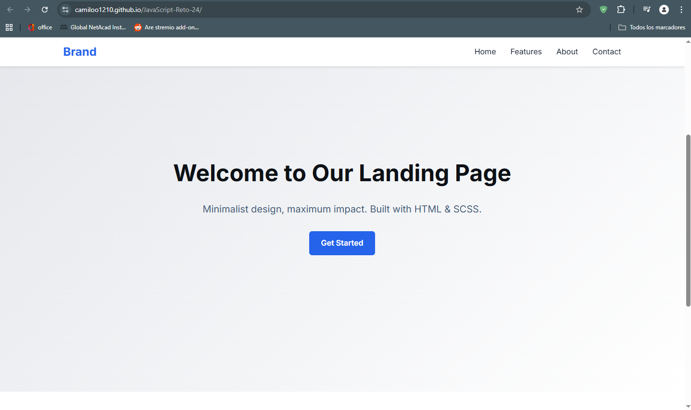

# Reto 24: JavaScript - Sticky Navbar

## Descripción breve del objetivo del reto
El objetivo de este reto es construir una landing page básica que implemente una barra de navegación (navbar) con efecto **Sticky** (pegajoso) utilizando **JavaScript**. La barra de navegación debe permanecer fija en la parte superior de la pantalla una vez que el usuario hace scroll más allá de su posición inicial, mejorando la navegación y la experiencia de usuario.

## Tecnologías utilizadas
*   **HTML5**: Para la estructura y semántica del contenido.
*   **SCSS (Sass)**: Para los estilos, utilizando variables y anidamiento para un código más limpio.
*   **JavaScript (Vanilla)**: Para la manipulación del DOM y el manejo del evento de scroll.

## Capturas de pantalla o GIF del funcionamiento

> 

> 

## Instrucciones para instalar o ejecutar localmente
1.  **Descargar o Clonar** el proyecto en tu máquina local.
2.  **Compilar SCSS** (Necesario si realizas cambios en `style.scss`):
    *   Si tienes Sass instalado: `sass style.scss style.css`
    *   Si usas VS Code, puedes usar la extensión "Live Sass Compiler".
3.  **Ejecutar el proyecto**:
    *   Abre el archivo `index.html` directamente en tu navegador.
    *   O utiliza un servidor local como **Live Server** para ver los cambios en tiempo real.

## Link al despliegue del proyecto
*   [Enlace al proyecto desplegado](#) *https://camiloo1210.github.io/JavaScript-Reto-24/*

## Autor
**Camilo Brazales**
